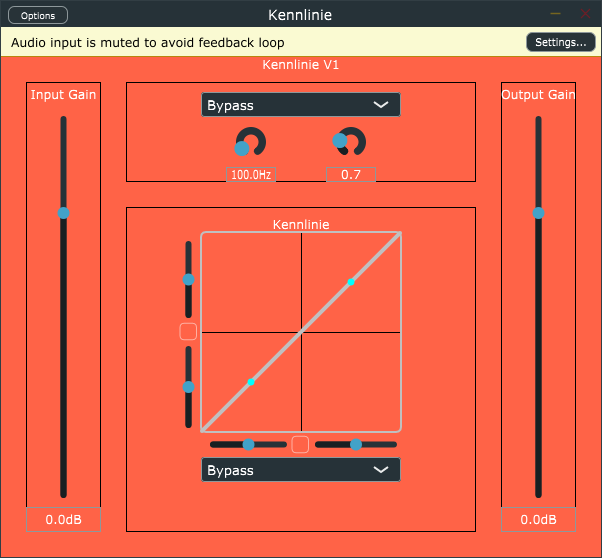

# Kennlinie - VST Plugin(Distortion)

## About

*Screenshot of the current state*

This plugin, written with [JUCE](https://juce.com/), should allow the user to define his/her own signature line for the signalprocessing of an incoming signal. With this line it should be possible to get non linear frequency response over the frequency range at all, like described in [Amplifier.cd](https://www.amplifier.cd/Tutorial/Distortion/nonlinear_distortions.html) or [comsol.com](https://www.comsol.com/blogs/how-to-perform-a-nonlinear-distortion-analysis-of-a-loudspeaker-driver/). For musicians - you can create your own distortion.

On my [private blog](https://steemit.com/deutsch/@konstice/kennlinie-ein-vst-plugin) there is a more detailed description of the problem in German.

If you have questions write me: konstice@gmail.com [german or english please]

You can use the code for everything you need except commercial use. Otherwise let me know.

I'm not liable for problems in general or your stupidity!

Greetings
konstice
